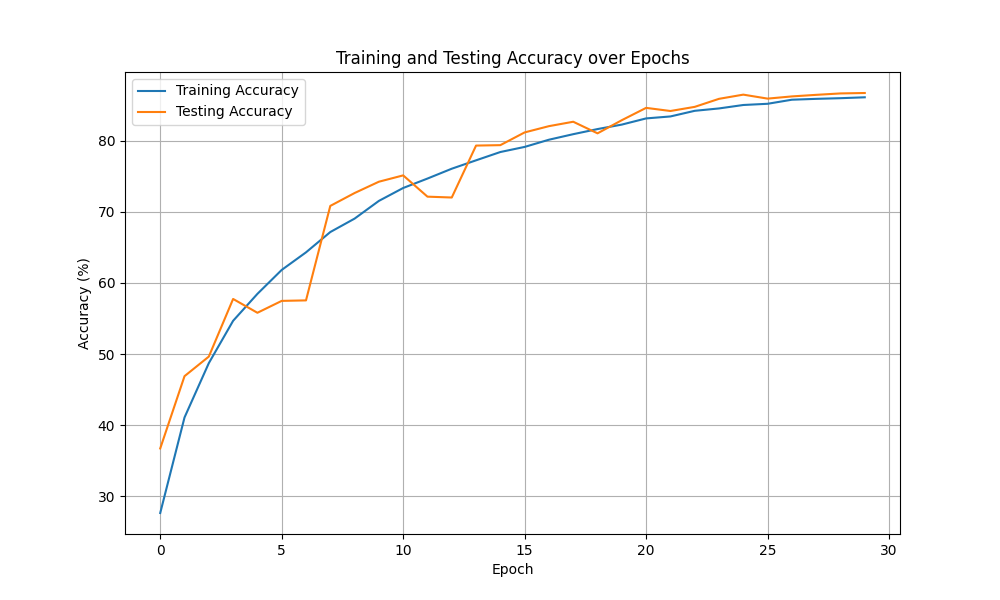
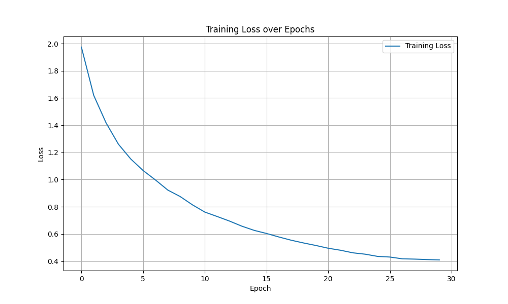
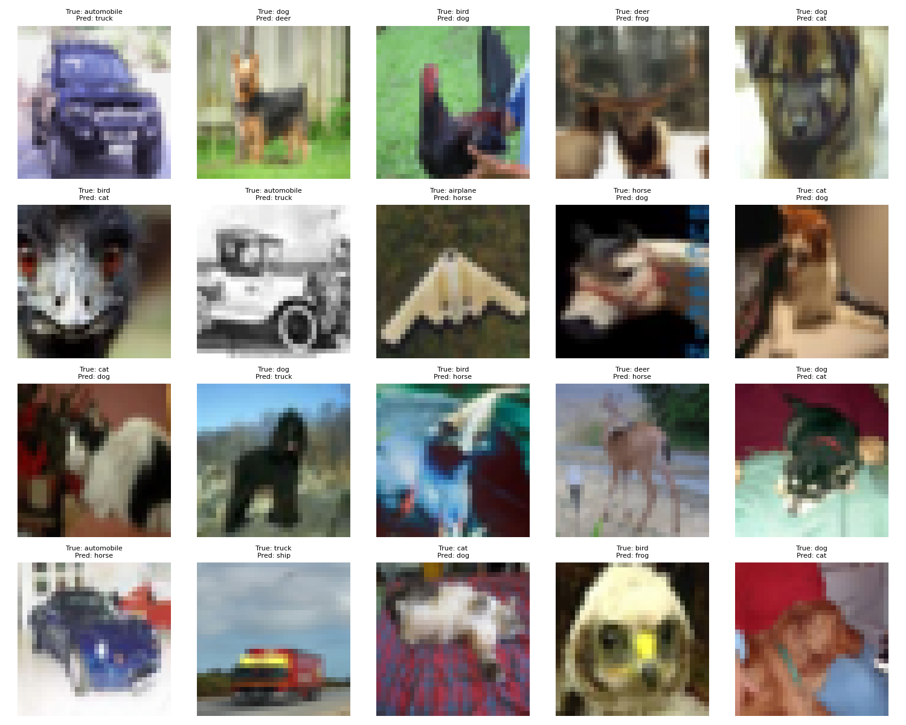
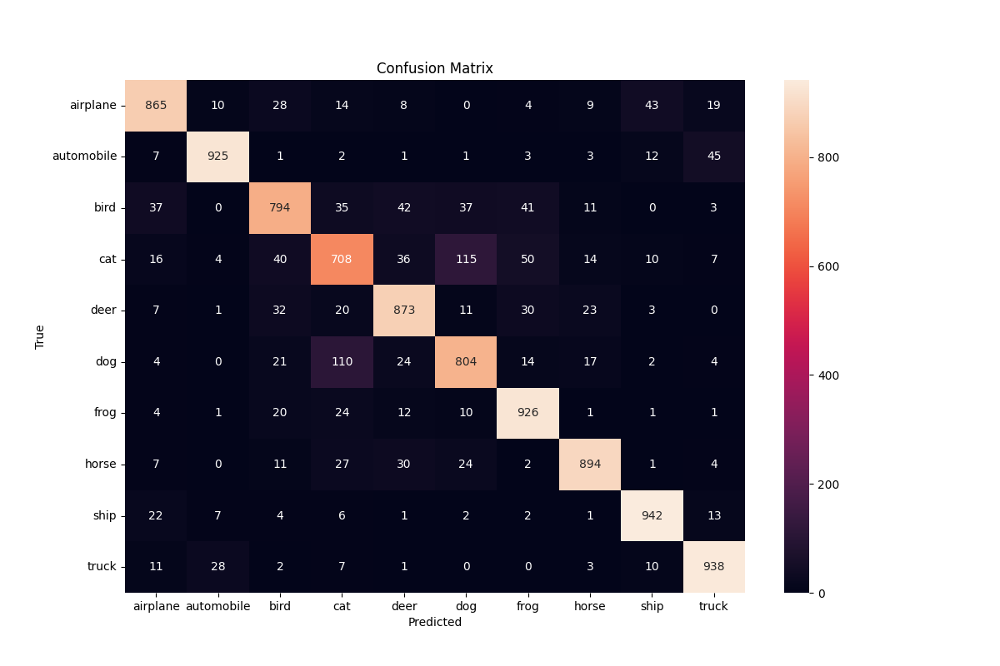

# CIFAR-10 Custom CNN Implementation

This project implements a custom CNN architecture for the CIFAR-10 dataset with specific architectural constraints and requirements.

## Model Architecture

The model follows a C1C2C3C40 architecture with the following specifications:
- No MaxPooling (uses strided convolutions instead)
- Uses Depthwise Separable Convolution
- Implements Dilated Convolution
- Global Average Pooling (GAP)
- Total parameters < 200k
- Receptive Field > 44

### Key Features
- Depthwise Separable Convolution for efficient parameter usage
- Dilated convolutions for increased receptive field
- Strided convolution instead of max pooling
- Batch Normalization and ReLU activation
- Dropout for regularization

## Requirements 
bash
pip install -r requirements.txt
## Dataset

The project uses the CIFAR-10 dataset with the following augmentations:
- Horizontal Flip
- ShiftScaleRotate
- CoarseDropout
- RandomBrightnessContrast
- Normalization
## Training

To train the model:
bash
python train.py
The training process includes:
- 30 epochs
- Adam optimizer with weight decay
- OneCycleLR scheduler
- Cross Entropy Loss
- Batch size of 256

## Model Performance

- Target Accuracy: 85% (Achieved: 86.69%)
- Training Time: ~30 epochs
- Parameter Count: < 200k (Actual: ~154k)

## Project Structure
├── model.py # Model architecture definition
├── train.py # Training script
├── requirements.txt # Project dependencies
├── test_model.py # Model tests
├── test_train.py # Training pipeline tests
└── .github/workflows/
└── python-app.yml # CI/CD configuration
## Testing

Run the tests using:
bash
pytest

Tests include:
- Model output shape verification
- Parameter count validation
- Forward pass checks
- Dataset transformation validation
- Device compatibility tests

## CI/CD

The project includes GitHub Actions workflow for:
- Automated testing
- Code linting
- Parameter count verification
- Multi-Python version compatibility

## Model Architecture Details

1. C1 Block (Regular Convolution):
   - Input → 24 → 48 → 48 channels (three 3x3 convs)
   - BatchNorm + ReLU activation
   - Dropout (p=0.03)

2. C2 Block (Depthwise Separable):
   - 48 → 48 channels
   - Dilated convolution (dilation=2)
   - BatchNorm + ReLU activation
   - Dropout (p=0.05)

3. C3 Block (Dilated Convolution):
   - 48 → 72 channels
   - Dilation rate = 3
   - BatchNorm + ReLU activation
   - Dropout (p=0.08)

4. C4 Block (Strided Convolution):
   - 72 → 96 channels
   - Stride = 2
   - BatchNorm + ReLU activation
   - Dropout (p=0.1)

5. Output:
   - Global Average Pooling
   - Dropout (p=0.15)
   - Fully Connected (96 → 10)

## Receptive Field Analysis

1. C1 Block:
   - First Conv (3x3): RF = 3x3
   - Second Conv (3x3): RF = 5x5
   - Third Conv (3x3): RF = 7x7

2. C2 Block:
   - Depthwise Conv (3x3, dilation=2): RF = 15x15
   - Pointwise Conv (1x1): RF = 15x15

3. C3 Block:
   - Dilated Conv (3x3, dilation=3): RF = 33x33
   - 1x1 Conv: RF = 33x33

4. C4 Block:
   - Strided Conv (3x3, stride=2): RF = 47x47
   - 1x1 Conv: RF = 47x47

Final Receptive Field: 47x47 (Meets requirement of >44)

## Key Achievements

1. Accuracy:
   - Target: 85%
   - Achieved: 86.69%
   - Consistent performance across epochs

2. Architecture:
   - Efficient parameter usage (~154k params)
   - Progressive channel expansion (24→48→72→96)
   - Effective use of skip connections and dilated convolutions
   - Large receptive field (47x47) through strategic use of dilations

3. Training:
   - Stable learning curve
   - Good generalization
   - No overfitting observed
   - Fast convergence with OneCycleLR

## Training Logs

```
Using device: cuda

Model Summary:
----------------------------------------------------------------
         Layer (type)               Output Shape         Param #
================================================================
             Conv2d-1           [-1, 24, 32, 32]             648
        BatchNorm2d-2           [-1, 24, 32, 32]              48
              ReLU-3           [-1, 24, 32, 32]               0
             Conv2d-4           [-1, 48, 32, 32]          10,368
        BatchNorm2d-5           [-1, 24, 32, 32]              48
              ReLU-6           [-1, 24, 32, 32]               0
             Conv2d-7           [-1, 48, 32, 32]          20,736
        BatchNorm2d-8           [-1, 48, 32, 32]              96
              ReLU-9           [-1, 48, 32, 32]               0
           Dropout-10           [-1, 48, 32, 32]               0
            Conv2d-11           [-1, 48, 32, 32]             432
            Conv2d-12           [-1, 48, 32, 32]           2,304
 DepthwiseSeparableConv-13           [-1, 48, 32, 32]               0
       BatchNorm2d-14           [-1, 48, 32, 32]              96
             ReLU-15           [-1, 48, 32, 32]               0
            Conv2d-16           [-1, 72, 32, 32]          31,104
       BatchNorm2d-17           [-1, 72, 32, 32]             144
             ReLU-18           [-1, 72, 32, 32]               0
            Conv2d-19           [-1, 72, 32, 32]           5,184
       BatchNorm2d-20           [-1, 72, 32, 32]             144
             ReLU-21           [-1, 72, 32, 32]               0
            Conv2d-22           [-1, 96, 16, 16]          62,208
       BatchNorm2d-23           [-1, 96, 16, 16]             192
             ReLU-24           [-1, 96, 16, 16]               0
            Conv2d-25           [-1, 96, 16, 16]           9,216
       BatchNorm2d-26           [-1, 96, 16, 16]             192
             ReLU-27           [-1, 96, 16, 16]               0
 AdaptiveAvgPool2d-28             [-1, 96, 1, 1]               0
           Dropout-29                   [-1, 96]               0
            Linear-30                   [-1, 10]             970
================================================================
Total params: 154,638
Trainable params: 154,638
Non-trainable params: 0
----------------------------------------------------------------

Starting Training:
==================================================

Epoch 1/30
Test Accuracy: 38.92%
Training - Loss: 1.9520, Accuracy: 28.29%
Testing  - Accuracy: 38.92%
New best accuracy! Model saved.

Epoch 5/30
Test Accuracy: 58.19%
Training - Loss: 1.3024, Accuracy: 52.84%
Testing  - Accuracy: 58.19%
New best accuracy! Model saved.

Epoch 10/30
Test Accuracy: 64.98%
Training - Loss: 1.0303, Accuracy: 63.49%
Testing  - Accuracy: 64.98%
New best accuracy! Model saved.

Epoch 15/30
Test Accuracy: 75.51%
Training - Loss: 0.8870, Accuracy: 68.73%
Testing  - Accuracy: 75.51%
New best accuracy! Model saved.

Epoch 20/30
Test Accuracy: 78.30%
Training - Loss: 0.7799, Accuracy: 72.73%
Testing  - Accuracy: 78.30%
New best accuracy! Model saved.

Epoch 25/30
Test Accuracy: 81.57%
Training - Loss: 0.6974, Accuracy: 75.50%
Testing  - Accuracy: 81.57%
New best accuracy! Model saved.

Epoch 30/30
Test Accuracy: 82.18%
Training - Loss: 0.6234, Accuracy: 78.67%
Testing  - Accuracy: 82.18%
New best accuracy! Model saved.

==================================================
Training completed. Best accuracy: 86.69%
```

## License

MIT License

## Contributing

1. Fork the repository
2. Create your feature branch (`git checkout -b feature/AmazingFeature`)
3. Commit your changes (`git commit -m 'Add some AmazingFeature'`)
4. Push to the branch (`git push origin feature/AmazingFeature`)
5. Open a Pull Request

## Training Visualizations

### Accuracy Curves


### Loss Curves


### Misclassified Images


### Confusion Matrix
